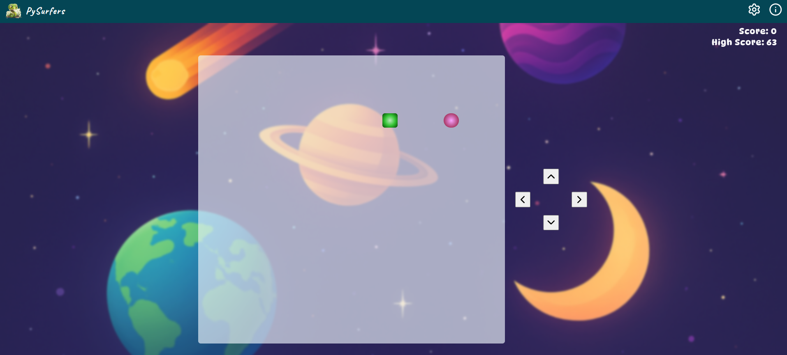
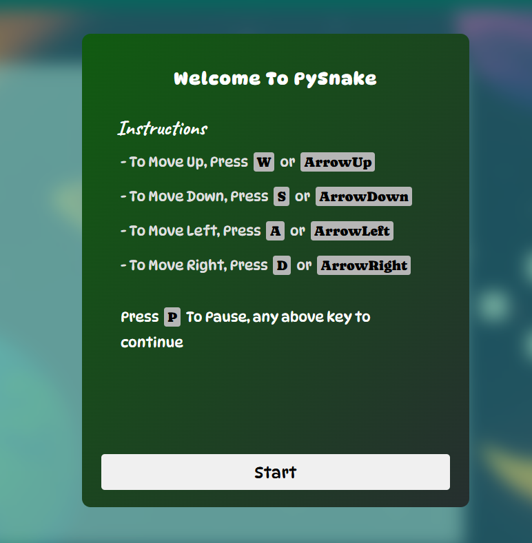

# Py Surfers

Py surfers is a 2D Interactive snake game. with a lot of cool features like -

-   Sound Effects
-   Game Music
-   Custom Controls
-   Custom Difficulty levels
-   Mobile Responsive

## Tech Used:

This game is created via vanila JS wiht bunch of css animation and Js Logic.

## Screenshots

### Game

### Controls

### Instructions / Rules

## Future Plans

-   Support for Different Maps like Liquid Walls, and Maze etc.
-   Increaed Difficulty levels
-   High Score history per map

Made with 💖 by Om Pant

